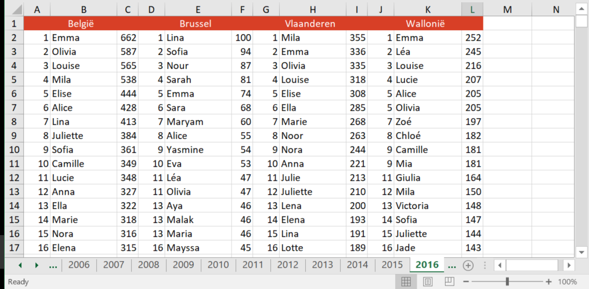

### What I was curious about: are there still Joke's born?
Everytime I pass by a colleague named Joke, I wonder. 
Joke is quite regular Dutch first name for a girl. You pronounce it [yo-ke], like blending 'yoghurt' and 'kebab' together and put the accent on the 'yo'. No-one who grew up speaking Dutch would bat an eye to hear about someone named Joke, but everyone else on this planet probably would.
Given the importance of English in our daily culture and business world I wondered whether there were any parents that would still name their daughter Joke, considering how it sounds in English.

## Data source
I found everything I needed on ([this website](http://statbel.fgov.be/nl/modules/publ2ications/statistiques/bevolking/bevolking_-_voornamen_van_de_pasgeborenen_1995-2014.jsp)) from the Belgian government.


## Data
Data came in the form of two excel files, one for girls and one for boys.
Every file contains a sheet for every year (1995-2016), and then numbers per region per name (see picture below). Not ideal, but we'll take care of that in the cleaning.


Two quick notes:

* Original data file contains the numbers for Belgium as a whole, and for every region seperate (Flander, Wallonia and Brussels). Only the Belgian data is pulled out into the clean file right now.
* No names below 5 occurences are present in the database, presumably for privacy reasons.

## Cleaning data
Starting by loading the packages needed:
```{r message=FALSE}
library(readxl)
library(tidyr)
library(dplyr)
library(ggplot2)
```

<br>
Next importing the files. 
```{r}
#Importing files
file_girls <- "First names girls 1995-2016.xls"
sheetnames_girls <- excel_sheets(file_girls) [1:22]
file_boys <- "First names boys 1995-2016.xls"
sheetnames_boys <- excel_sheets(file_girls) [1:22]
```


<br>
Next I wanted to build a function to read all those sheets and bind the data together. I typically first write the code for one sheet before turning it into a function. At least then I know everything works like i want it to.

```{r eval=FALSE}
#Trial set to build up the function later on
input1995 <- read_excel(file, "1995")
data1995<- input1995[,2:3]
data1995$Year <- 1995L
data1995$Region <- "Total Belgium"
``` 

<br>
Then I turned that into the actual function, which: 
* Reads a worksheet from the excel file 
* Retains only column two and three which represents the names and number of occurences 
* Turns the sheetname into a variable called Year
* And adds a variable region "Total Belgium"

```{r}
#A function that read a sheet(representing a year), and returns Total Belgium data
read_excelsheet <- function (file, sheetname) {
  input <- read_excel(file, sheetname)
  data <- input[,2:3]
  data$Year <- as.integer(sheetname)
  data$Region <- "Total Belgium"
  return(data)
}
```

<br>
With the function r read_excelsheet set up, it's time to start reading in the data. I used a for loop to go through all the sheetnames defined in r sheetnames_girls and bind every new data to the previous ones.
```{r}
#Reading all sheets 
data_g <- data.frame()
for (i in sheetnames_girls) {
  data_g <- bind_rows(data_g,read_excelsheet(file_girls, i))
}

data_b <- data.frame()
for (i in sheetnames_boys) {
  data_b <- bind_rows(data_b,read_excelsheet(file_boys, i))
}
```


<br>
Nearly there. I combined the girls and boys data, and did some touching up by changing column names and changing their order.
```{r}
#Combine girls and boys in 1 database
data_g$Gender <- "Girls"
data_b$Gender <- "Boys"
data <- data.frame(bind_rows(data_g, data_b))

#Renaming columns and clean-up
colnames(data)[1:2] <- c("Name", "Count")
data<- select(data, Region, Year, Gender, Name, Count)
rm(data_b)
rm(data_g)
```


<br>
Cleaning is all done now! For anyone who does not want to go through the cleaning, I added a cleaned file via r write.csv into ([my github repository](https://github.com/suzanbaert/PP1---First-names-in-Belgium)).
´´´{r}
head(data)
```

## Searching for Joke

#Searching for Joke
Joke <- filter(data, Name=="Joke")
Joke %>% 
  group_by (Year) %>% 
  summarise(Count)

#Adding empty rows until 2016
Joke2 <- Joke %>%
  rbind(list("Total Belgium", 2013, "Girls", "Joke", 0)) %>% 
  rbind(list("Total Belgium", 2014, "Girls", "Joke", 0)) %>% 
  rbind(list("Total Belgium", 2015, "Girls", "Joke", 0)) %>% 
  rbind(list("Total Belgium", 2016, "Girls", "Joke", 0)) 


#Plotting Jokes
ggplot(data=Joke, aes(Year, Count))+
  geom_line(color="#88398A", size=1)+
  labs(y="Number of occurences", title="Girls born with the name Joke in Belgium")+
  theme(plot.title = element_text(colour = "#88398A"))